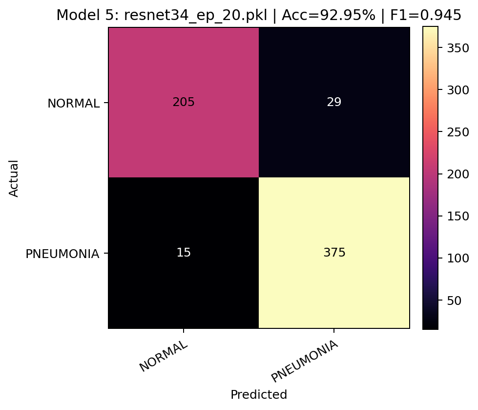

# LAB1
Detect Pneumonia from chest X-Ray images


## Datasets
[Chest X-ray](https://www.kaggle.com/datasets/paultimothymooney/chest-xray-pneumonia) on Kaggle
| Dataset | NORMAL | PNEUMONIA |
|:--|:--:|:--:|
| Train | **1341** | **3875** |
| Val | **8** | **8** |
| Test | **234** | **390** |
| **Total** | **1583** | **4273** |
---

## 📁 Project Structure
```
LAB1/
│
├── preprocessing.py     # Image preprocessing (CLAHE, resize to 512×512)
├── train.py             # Training pipeline for classification models
├── inference.py         # Model inference on test dataset
├── voting.py            # Voting ensemble of multiple trained models
├── draw.py              # Draw curves from csvs
│
├── csvs/                # Training and validation logs (acc, F1 per epoch)
├── cm_plot/             # Confusion matrix heatmaps
├── plots/               # Accuracy and F1-score curves
└── pkls/                # Trained model weights (.pkl) -->　In Google Cloud
```
---
## Code tran.py
Different models choose different ==> model_ft

For resnet model:
- num_ftrs = model_ft.fc.in_features \n
- model_ft.fc = nn.Linear(num_ftrs, n_class) 

For not resnet model:
- in_features = model_ft.get_classifier().in_features
- model_ft.reset_classifier(num_classes=n_class)
```
# select model
model_select = 'vgg16'

# For vgg efficientnet densenet  resnet
model_ft = timm.create_model(model_select, pretrained=True)

# For 'vit_base_patch16_224'
#model_ft = timm.create_model(model_select, pretrained=True,img_size=512) 

# For resnet model
'''
num_ftrs = model_ft.fc.in_features
model_ft.fc = nn.Linear(num_ftrs, n_class)
'''

# For not resnet model
in_features = model_ft.get_classifier().in_features
model_ft.reset_classifier(num_classes=n_class)
```
---
## Folder Descriptions

| Folder | Description |
|:--|:--|
| `csvs/` | Training and validation logs | 
| `cm_plot/` | Confusion matrix heatmaps | 
| `plots/` | Accuracy & F1-score curves |
| `pkls/` | Model weights (.pkl) | 
- **Because of the file size limit, you can download the model weights (.pkl files) from Google Cloud :** [pkls](https://drive.google.com/drive/folders/1MaRhkFk5fxD5Tn6RfLvimDjYHDQ80gMe?usp=sharing)
---
## Best single model (ResNet34)

✅ Final performance on test set：  
- **Accuracy:** 92.95%  
- **F1-score:** 0.945  


## Voting Ensemble 

✅ Final performance on test set：  
- **voting by ResNet34, ResNet50, ResNet18 , VGG16**
- **Accuracy:** 93.27%  
- **F1-score:** 0.926  


---
## Model Performance Summary  

| Model | Epochs | Test Accuracy | Test F1-score |
|:--|:--:|:--:|:--:|
| ResNet18 | 15 | **85.90%** | **0.897** |
| ResNet18 | 20 | **90.54%** | **0.928** |
| ResNet18 | 25 | **81.09%** | **0.868** |
| **ResNet34** | 20 | **92.95%** | **0.945** |
| ResNet50 | 20 | **88.78%** | **0.916** |
| ResNet101 | 20 | **86.06%** | **0.899** |
| ResNet152 | 20 | **83.17%** | **0.880** |
| ResNet26D | 20 | **83.97%** | **0.885** |
| EfficientNet (tf_efficientnet_b0) | 20 | **76.44%** | **0.841** |
| DenseNet161 | 20 | **87.50%** | **0.907** |
| VGG16 | 20 | **89.90%** | **0.923** |
| Vision Transformer (ViT Base Patch16 224) | 20 | **77.08%** | **0.844** |
| **Voting Ensemble** | 20 |**93.27%** |  **0.926** |
---


